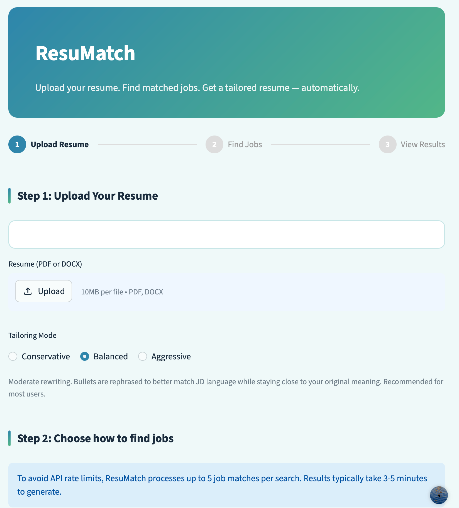
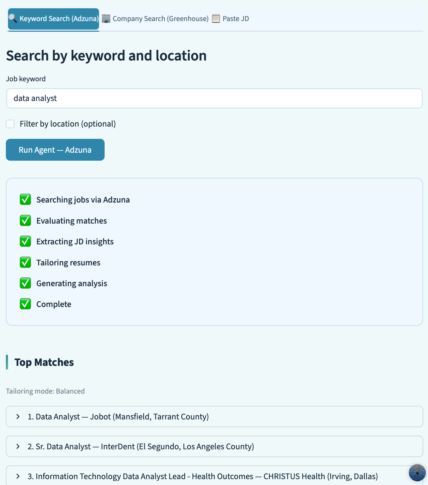
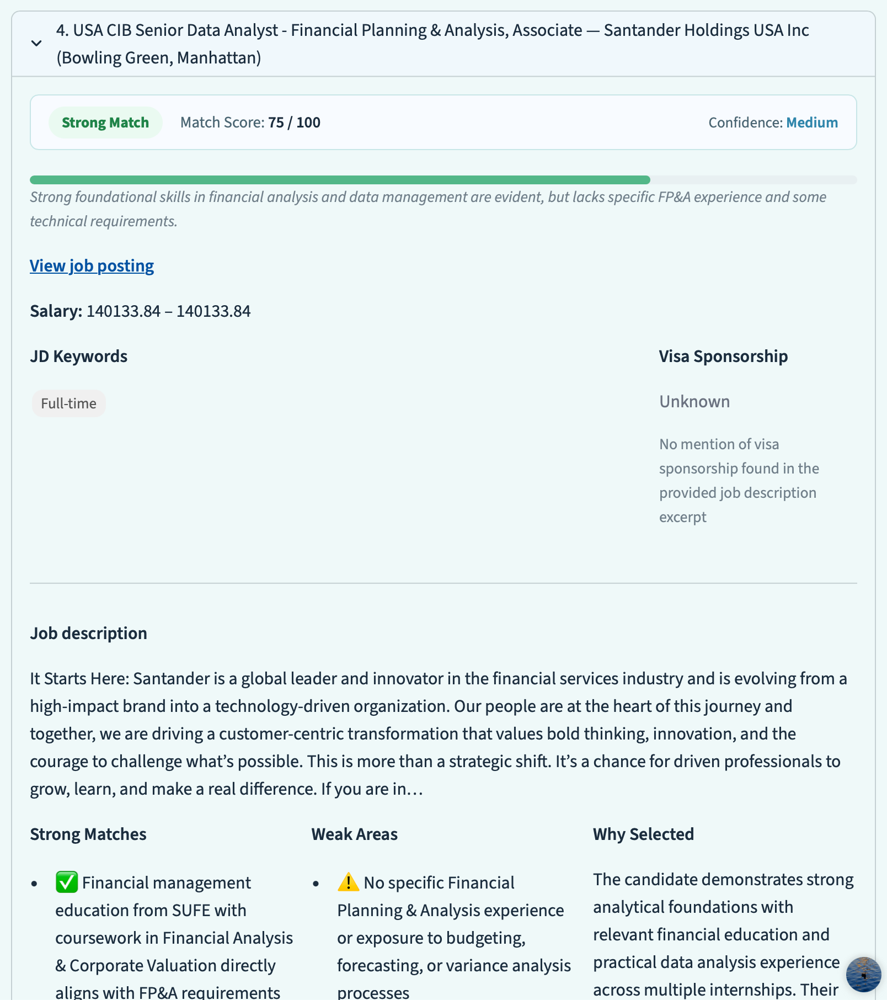
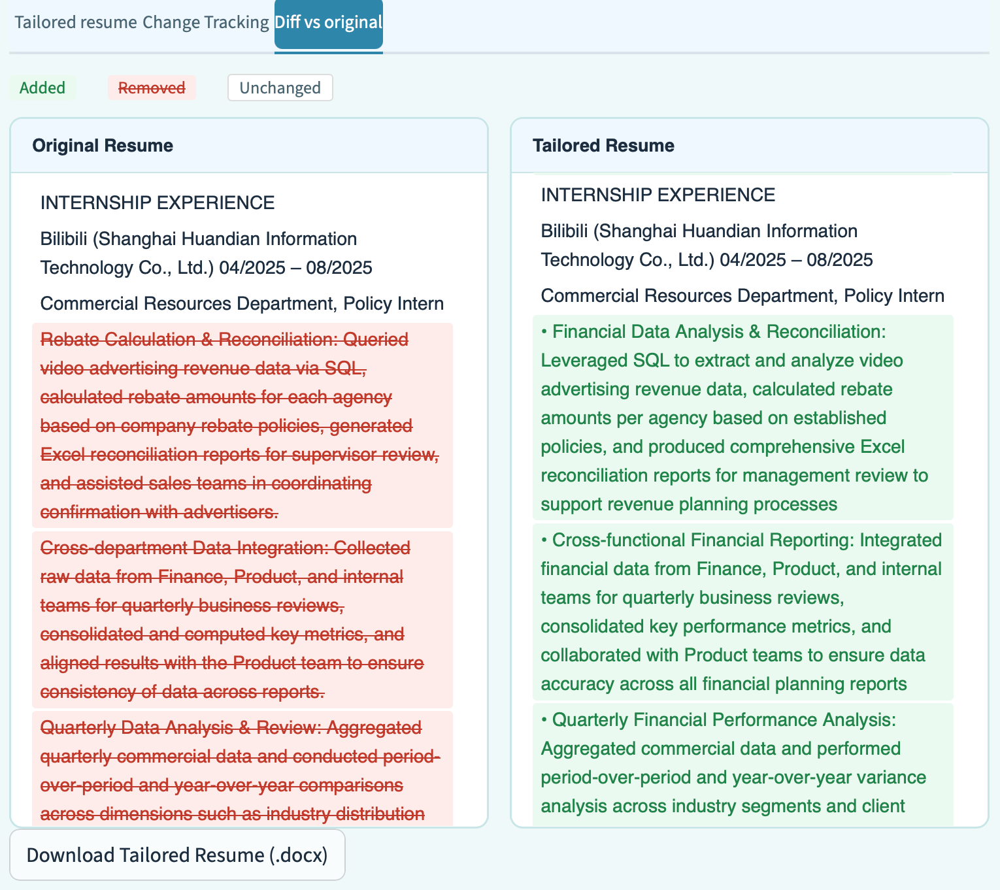

# ResuMatch — AI Resume Tailoring Agent

> Upload your resume. Find matched jobs. Get a tailored resume — automatically.

**Live demo:** https://resumatchs.streamlit.app/
**GitHub:** https://github.com/edelzhao1r/resumatch

---

## 1. Context, User, and Problem

**Who is the user?**
Recent or soon-to-be graduates actively job hunting in the U.S. market,
particularly in tech, data, and finance roles. They have a solid base resume
but lack time to manually customize it for each application.

**What workflow is being improved?**
The current workflow looks like this: a job seeker finds a relevant job posting,
reads through the job description, manually edits their resume to match the
language and requirements, and submits. For each new job, this process repeats
from scratch. Done well, it takes 30–60 minutes per application.

**Why does this problem matter?**
Two reasons. First, ATS (Applicant Tracking Systems) filter resumes by keyword
match before a human reads them — a resume that doesn't mirror the JD's phrasing
may be rejected automatically. Second, doing this well for every job a candidate
applies to is cognitively expensive and inconsistent. Automating the tailoring
step with an AI agent meaningfully lowers the barrier to applying broadly while
maintaining quality.

---

## 2. Solution and Design

**What was built:**
ResuMatch is a Streamlit app powered by the Anthropic Claude API. The user
uploads their resume (PDF or DOCX), chooses a job search mode, and the agent
automatically searches for matching positions, scores each one against the resume,
and produces a tailored version of the resume for each match.

**How it works:**

1. User uploads resume → parsed by pdfplumber or python-docx
2. User selects search mode:
   - Keyword Search (Adzuna API) — broad search by job title and location
   - Company Search (Greenhouse public API) — pull live openings directly from specific company career pages
   - Paste JD — user provides a job description directly
3. Claude agent runs a ReAct loop: searches for jobs, scores match quality against the resume, refines the search query if needed (max 3 iterations)
4. For each top match, the agent produces:
   - A tailored resume rewritten to align with JD language and priorities
   - A match analysis (score, confidence, strong matches, weak areas, why selected)
   - JD keyword tags and visa sponsorship detection
   - A change tracking table classifying each edit (Added keyword / Rewritten bullet / Potentially exaggerated)
   - A side-by-side diff view showing exactly what changed
   - A downloadable .docx file

**Key GenAI design choices:**

*Tool Use / Function Calling (Week 4):*
The agent has two registered tools: search_jobs_adzuna() and
search_jobs_greenhouse(). Claude decides when to call each tool, what
parameters to pass, and whether to retry with a refined query based on
the quality of results returned.

*Context Engineering (Week 3):*
The resume tailoring step uses a carefully constructed prompt: a system
prompt that defines the agent's role and enforces a hard constraint against
fabricating experience, three few-shot examples of original-to-tailored
bullet rewrites to stabilize output format and style, and a consistent
template that injects the full parsed JD and original resume into the context.

*Tailoring Mode:*
Users choose between Conservative (keyword substitution only), Balanced
(moderate rewriting), or Aggressive (substantial restructuring). This gives
users explicit control over risk level and makes the tradeoff between
alignment and faithfulness transparent.

**Where a human must stay involved:**
ResuMatch is a decision-support tool, not an autonomous applicant. The diff
view and change tracking exist specifically to make human review easy.
Match scores are AI estimates, not ground truth. The tailored resume should
always be reviewed before submission.

---

## 3. Evaluation and Results

ResuMatch was evaluated across 15 real job listings spanning Data Analytics,
Finance, Consulting, and Engineering roles, using a fixed sample resume.

**Baseline:**
A naive ChatGPT-style workflow: single prompt to Claude with no system
instructions, no few-shot examples, and no constraints — simulating what a
user gets when they paste their resume and a JD into ChatGPT without guidance.

**What counts as good output:**
A good tailored resume (1) increases semantic alignment with the JD,
(2) incorporates more of the JD's priority keywords, and (3) does so without
fabricating skills or experiences the candidate does not have.

**Metrics:**
- TF-IDF cosine similarity between the tailored resume and the JD
- Keyword coverage: percentage of top-20 JD keywords present in the resume
- Fabrication rate: percentage of newly added JD keywords that have no
  grounding in the original resume (measures hallucination risk)

**Results:**

| Metric | Original Resume | ChatGPT Baseline | ResuMatch |
|--------|----------------|-----------------|-----------|
| TF-IDF similarity (avg) | — | — | +0.117 vs original |
| Keyword coverage (avg) | — | 56.3% | 62.7% |
| Fabrication rate (avg) | 0% | 48% | 40% |

**Key findings:**

ResuMatch improved TF-IDF similarity by +0.117 and keyword coverage by +26pp
versus the original resume, confirming that the rewrites are meaningful and
JD-aligned.

The naive baseline achieves slightly higher keyword coverage (+9pp over ResuMatch)
but does so by fabricating experience: 48% of the JD keywords it introduces have
no grounding in the candidate's original resume. ResuMatch's fabrication rate is
40%, with improvements of up to 20pp on cases such as EY (18% vs 44%),
Stripe (45% vs 65%), and Notion (27% vs 50%). The coverage gap is largely
explained by the baseline's willingness to invent keywords.

**Where it broke down:**
- On roles with large skill gaps (Figma BI Analyst, McKinsey Strategy Analyst),
  both ResuMatch and the baseline struggled — fabrication rates converged because
  honest rewrites have nowhere to go when the candidate lacks core requirements
- Aggressive tailoring mode occasionally introduced overstatements (flagged by
  the Potentially Exaggerated category in change tracking)
- Greenhouse API coverage is limited to ~200 supported companies; niche employers
  are not reachable via that route

**Evaluation script:** evaluation/run_eval.py
**Full results:** evaluation/results.csv
**Results are cached** in evaluation/cache.json — re-running the script does not
require additional API calls

---

## 4. Artifact Snapshot

**Screenshots:**

Upload interface and tailoring mode selector:


Agent progress log and top matches:


Match analysis — score, confidence, strong matches, weak areas:


Side-by-side diff view — red removed, green added:


**Sample input:**
- Resume: a graduate student with SQL, Python, and data analytics internship experience
- Search: "data analyst" via Adzuna, no location filter

**Sample output (Cloudflare Data Analytics Intern):**
- Match Score: 75/100, Confidence: Medium
- Strong Matches: SQL experience, data visualization, cross-functional reporting
- Weak Areas: no AI-native tooling, limited internet/network domain knowledge
- Tailored resume available as .docx download

---

## API Keys — For Graders

This project requires three API keys. Set them in `.streamlit/secrets.toml`
(for local) or in Streamlit Cloud Secrets (for deployment):

```toml
ANTHROPIC_API_KEY = "your_key"   # https://console.anthropic.com
ADZUNA_APP_ID     = "your_id"    # https://developer.adzuna.com/signup (free)
ADZUNA_APP_KEY    = "your_key"   # same as above
```

The Greenhouse API requires no key — it is a public endpoint.

The live demo at https://resumatchs.streamlit.app/ is fully functional
and requires no setup.

---

## Local Setup

1. Clone the repo:
   ```
   git clone https://github.com/edelzhao1r/resumatch.git
   cd resumatch
   ```

2. Install dependencies:
   ```
   pip install -r requirements.txt
   ```

3. Set up API keys:
   ```
   cp .streamlit/secrets.toml.example .streamlit/secrets.toml
   # Edit .streamlit/secrets.toml and fill in your keys
   ```

4. Run:
   ```
   streamlit run app.py
   ```

---

## Project Structure

```
resumatch/
├── app.py                     # Streamlit UI — all user-facing logic
├── src/
│   ├── agent.py               # Claude agent, ReAct loop, Tool Use
│   ├── job_search.py          # Adzuna API tool + JD paste handler
│   ├── greenhouse_search.py   # Greenhouse public API tool
│   ├── resume_parser.py       # PDF and DOCX parsing
│   ├── tailoring.py           # Resume rewriting, match analysis, change tracking
│   └── docx_generator.py      # Word document export
├── evaluation/
│   ├── run_eval.py            # Evaluation pipeline (15 test cases)
│   ├── metrics.py             # TF-IDF, keyword coverage, fabrication rate
│   ├── results.csv            # Full evaluation results
│   └── cache.json             # Cached API outputs (not committed)
├── docs/
│   └── screenshots/           # README screenshots
├── .streamlit/
│   ├── config.toml            # Theme configuration
│   └── secrets.toml.example   # API key template
├── .gitignore
├── requirements.txt
└── README.md
```

---

## Tech Stack

- Streamlit — UI
- Anthropic Claude API (claude-sonnet-4-20250514) — agent, tailoring, analysis
- Adzuna API — keyword-based job search
- Greenhouse Public API — company-specific job listings (no key required)
- pdfplumber / python-docx — resume parsing
- python-docx — tailored resume export
- scikit-learn — TF-IDF evaluation metrics

---

## Important Notes

- Resumes are processed in-session only and never stored server-side
- Match scores are AI estimates — treat as directional guidance, not ground truth
- Always review the tailored resume before submitting to any application
- Aggressive tailoring mode makes substantial changes — review the diff carefully
